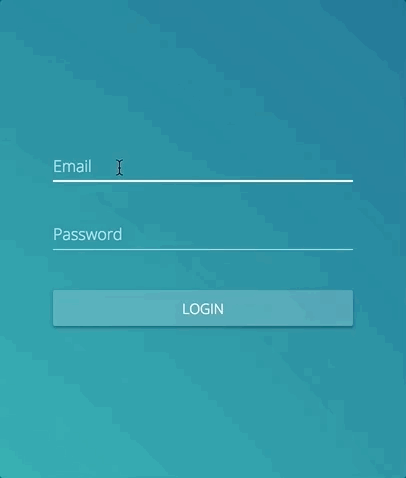

React Material Boiler App
=========================
> A boilerplate responsive web app built with React, Redux and MaterialUI.

[](https://npmjs.org/package/react-material-boiler-app "View this project on npm")
[](http://opensource.org/licenses/MIT)
[](https://npmjs.org/package/react-material-boiler-app "View this project on npm")





## Development setup

Clone

```
git clone https://github.com/MrVann/React-Material-Boiler-App
```

Install

```
npm install --dev
```

Develop

```
npm start
```

## Mock a login

To mock login interactions, add the following to the browser console.

`var mockError = true;`: Mocks a login error.

`var mock = true;`: Mocks a successful login.

## Usage example

__React Material Boiler App__ is a boilerplate responsive web app built in React, Redux and [MaterialUI](https://material-ui.com/).
It can be used as a boiler plate for applications that require a log in screen, application menu, and other standard but more time consuming features.

## Release History

* 0.1.0
    * The first proper release. Includes all core functionality for a web app.

## Meta

__MrVann__ - [https://github.com/MrVann](https://github.com/MrVann)

Distributed under the MIT license. See [``LICENSE``](LICENSE) for more information.

## Contributing

1. Fork it (<https://github.com/MrVann/React-Material-Boiler-App/fork>)
2. Create your feature branch (`git checkout -b feature/fooBar`)
3. Commit your changes (`git commit -am 'Add some fooBar'`)
4. Push to the branch (`git push origin feature/fooBar`)
5. Create a new Pull Request